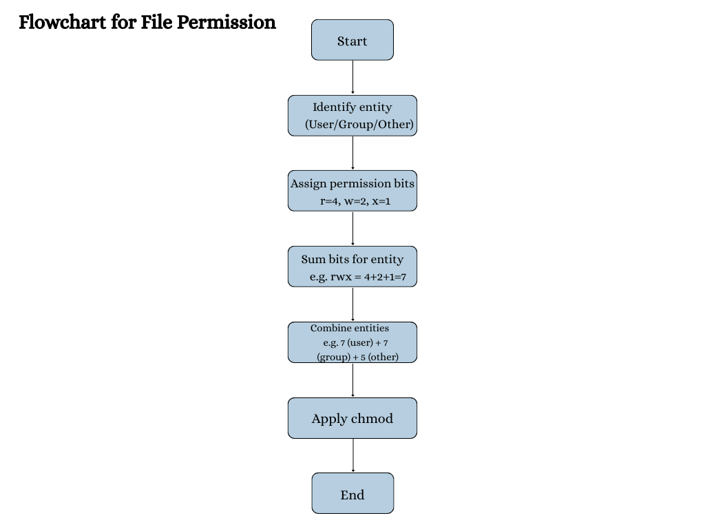

# File Permissions in Linux + Python `chmod` Script

## 📌 Task Overview
This project demonstrates:
1. Understanding Linux file permissions (`rwx` for **user**, **group**, and **others**).
2. Visualizing the permission setting process with a flowchart.
3. Applying the `chmod` command programmatically in Python to set permissions to `rwxrwxr-x` (`775`).

---

## 📖 Understanding File Permissions

In Linux, file permissions are divided into three groups:
- **User (owner)**
- **Group**
- **Others**

Each permission type:
- `r` = read (4)
- `w` = write (2)
- `x` = execute (1)

The sum of these values gives the numeric permission for each group.

Example:
```text
rwxrwxr-x
↑   ↑   ↑
7   7   5   ← (4+2+1, 4+2+1, 4+0+1)
```

Numeric notation: **775**

Meaning:
- User: read, write, execute
- Group: read, write, execute
- Others: read, execute

---

## 📊 Flowchart

Below is the flowchart showing how permissions are determined and applied:



---

## 🛠️ Project Files

- **example.py** → A sample Python file to test permission changes.
- **set_permissions.py** → Python script to set Unix permissions on files or folders.
- **permissions_flowchart.png** → Flowchart for the permission-setting process.
- **README.md** → This guide.

---

## 🚀 How to Use

### 1️⃣ Clone or Download
Download the ZIP from this repository or clone it:
```bash
git clone <your_repo_url>
cd chmod_task
```
If downloaded as ZIP:
unzip chmod_task_package.zip
cd chmod_task

### 2️⃣ Check Current Permissions
```bash
ls -l example.py
```
You will see something like:
```csharp
-rw-r--r--  1 user  group  23 Aug 15 12:00 example.py
```

### 3️⃣ Run the Python chmod Script
```bash
python3 set_permissions.py example.py
```
Default mode is 775:
```pgsql
Before: symbolic=-rw-r--r-- numeric=644
After:  symbolic=-rwxrwxr-x numeric=775
Changed permissions on 1 item(s). Done.
```

### 4️⃣ Verify the Change
```bash
ls -l example.py
```
Now you should see:
```sql
-rwxrwxr-x  1 user  group  23 Aug 15 12:00 example.py
```

---

## 📸 Screenshot


---

## 📌 Notes
- Works fully on Linux and macOS.
- On Windows, chmod support is limited by the filesystem and OS.
- Octal mode is specified as numbers like 775, 644, 700.
